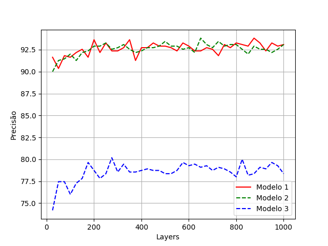
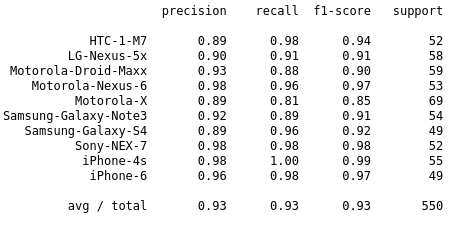

# Identificação do modelo da câmera
Solução do problema Camera Model do Kaggle sem utilizar deep learning

## Introdução

Para fazer a identificação do modelo da câmera será utilizado o método de  classificação, onde cada imagem do dataset de teste será classificado em uma das classes de modelos de camêras utilizados. Os métodos que serão utilizados para fazer esta classificação serão LogR e métodos baseados em NN. 

Nas seções seguintes serão apresentados o conjunto de dados para essa atividade, e todos os passos realizados para a obtenção do modelo.

## Atividades
Nesse trabalho, com o intuito de identificar o modelo da câmera que registrou uma fotografia, foram realizadas e apresentadas as seguintes atividades:

* Carregamento, modificação e expansão do dataset;
* Feature extration e Feature scaling;
* Exploração da LogRe NN.

## O dataset
O dataset que será utilizado neste trabalho é o Camera Model Identification. Este contém 2750 imagens para o treinamento, onde 80% (2200 exemplos) dessas imagens foram utilizados para fazer o treinamento do algoritmo e 20% (550 exemplos) foram utilizados para realizar a validação.

O arquivo de teste é composto por 2640 imagens, sem nenhuma rotulação, onde 50% dessas imagens foram transformadas utilizando algum dos métodos citados nas seções seguintes. Para computar a precisão do arquivo de teste, deve ser gerado um CSV com o resultado da classificação para submeter no Kaggle.  

O primeiro desafio com este dataset consiste na extração de features das imagens que possam ser utilizados na classificação, que será discutido na próxima seção.

## Feature Extration

Nas subseções seguintes serão apresentados todos os métodos e suas combinações utilizadas para fazer a extração de features das imagens.

Após cada extração, os features extraídos foram treinados com um classificador LogR multi classes cuja algoritmo de treinamento usa o esquema one-vs-rest. Para cada aplicação do algoritmo foi realizado o calculo da precisão normalizada sobre o conjunto de validação.

### Local Binary Pattern

O primeiro método utilizado para fazer a extração de features foi o Local Binary Pattern (LBP) com 24 pontos e raio 8. Este foi aplicado em todas as imagens originais do dataset (convertendo-a para tons de cinza).

Para cada imagem de entrada, tem-se uma imagem de saída com mesma dimensão da imagem original. Para cada imagem de saída, foi montado um histograma com 24 bins e seus valores utilizados como features. Este treinamento obteve apenas 16% de precisão. Aplicando a mesma técnica para cada canal da imagem (RGB) obteve-se 19% de precisão.

### Ruído na imagem
O primeiro teste diretamente com o ruído, foi feito utilizando uma função da openCV (fastNlMeansDenoisingColored) que faz a extração do ruído de uma imagem e retorna a imagem sem ruído.

Então a imagem original foi subtraída da imagem sem ruído, tendo como resultado somente o ruído. Nesse ruído foi aplicado o LBS (com a mesma configuração mencionada anteriormente) obtendo uma precisão de 18%.

### Wavelets
No próximo teste foi separado os 3 canais de cores, e para cada um deles foi feita uma decomposição multi level utilizando Discrete Wavelet Transform (DWT). Os coeficientes obtidos após aplicar essa transformação foram filtrados utilizando um limiar. Após o filtro, foi feita a reconstrução da imagem a partir dos coeficientes filtrados (utilizando a Inverse Discrete Wavelet Transform - IDWT. A imagem original foi subtraída dessa imagem filtrada, e foi aplicado o LBP, obtendo precisão de 21%. 

Também foi testada a aplicação deste processo para cada bloco da imagem (64 x 64) separadamente, mas o processo não apresentou bons resultados e o custo computacional para a extração de features foi bem maior, então essa divisão foi descartada. 

Com esse método também foi testado diversos outros filtros, sendo um dos que apresentou melhor resultado o filtro de Wiener. Utilizando este filtro e fazendo pequenos ajustes no modelo, obteve-se uma precisão de 31%.

Como o modelo ainda não está satisfatório, foi adicionada novas etapas e removidas outras afim de melhorar a precisão.

Uma das etapas adicionadas que melhorou os resultados, foi a utilização da DWT aplicada por 3 vezes em sequência, sendo a primeira delas aplicada na imagem original em tons de cinza, e as outras duas aplicações foram feita em cima da matriz de aproximação (canal recursivo) retornada pela DWT. 

Após a aplicação de cada transformação foi montando um histograma e a calculado a mean, variance, skew e kurtosis para cada um dos vetores de detalhe (horizontal, vertical e diagonal), sendo estas as mesmas estatísticas utilizadas por wang2009source.

Com esse processo foram obtidos 36 features por imagem (1 canal * 3 escalas * 3 vetores * 4 estatísticas ). Treinando esse modelo obteve-se uma precisão de 39%. 

O próximo passo consistiu de aplicar esse mesmo processo para cada canal de cor, ao invés da imagem em tons de cinza. Com isso tem se um total de 108 features (36 features * 3 canais), obtendo precisão de 51%.

### Scaling
No modelo atual, tem-se uma quantidade razoável de features e com valores não padronizado, necessitando a aplicação de um método de feature scaling. Foram testados o Rescaling, Mean normalisation e Standardization.

Dentre esses o que obteve melhor resultado foi o Standerization, subindo a precisão de 51% para 72%, o que confirma que os dados estavam desequilibrados.

### Ajuste de extração

Na tentativa de obter melhor precisão foram realizados diversos testes com o modelo. Um deles, que melhorou  os resultados, consiste da substituição do cálculo do histograma dos coeficientes das DWTs para uma simples vetorização destes coeficientes, obtendo uma precisão para 92.5%.

### Testando no Kaggle

Após obter 92.5% de precisão na validação, foi realizado a primeira submissão da classificação dos arquivos de teste no Kaggle. Para isso, foi utilizado o modelo treinado para computar as classes do arquivo de teste, visando verificar se os features extraídos também conseguiriam representar adequadamente os arquivos de teste.

Os resultados obtidos foram submetido no Kaggle obtendo uma precisão de 23%, o que é bem diferente dos resultados apresentados na validação. Commo a precisão no teste foi baixa, a extração de features não está satisfatória.  

### Modificação e expansão do dataset de treino

O próximo passo após a precisão ruim no Kaggle, foi fazer algumas transformações no dataset de treino para torná-lo mais compatível com as imagens de teste. 

O primeiro passo foi recortar todas as imagens do dataset de treinamento para uma imagem de 512 x 512 extraída do centro da imagem original, assim como no teste. 

Esse processo fez com a precisão na validação diminuísse para 79.8%, no entanto o teste submetido no Kaggle obteve precisão de 36% (aumento de 13%).

Ainda pensando em tornar o dataset de treinamento mas aproximado do dataset de teste, foi criado um novo dataset a partir das imagens originais (cortadas) aplicadas algumas transformações.

Para cada imagem imagem do dataset de treinamento foi aplicada as seguintes transformações:

* Compressão JPEG com fator de qualidade = 70;
* Compressão JPEG com fator de qualidade = 90;
* Redimensionamento (fator de 0,5);
* Redimensionamento (fator de 0,8);
* Redimensionamento (fator de 1,5);
* Redimensionamento (fator de 2,0);
* Correção gama (gama = 0,8);
* Correção gama (gama = 1,2);
* Rotação de \ang{90;
* Rotação de \ang{180;
* Rotação de \ang{270;

Após este processo, tem se um total de 11 transformações e 2750 imagens, então o novo dataset possuir 30250 imagens. Com isso foi feito o treinamento sem as imagens transformadas (train 1 - 2750 imagens orinais cortadas), somente com as imagens transformadas (train 2 - 30250 imagens), todas as imagens utilizando dois classificadores (uma para imagens não alteradas e outro para imagens alteradas - train 3) combinando o resultado, e por fim um treinamento com todas as imagens (30250 imagens manipuladas e 2750 imagens sem manipulação - train 4). O resultado de todos esses testes podem ser visto na tabela abaixo.

| Treinamento  | Validação  | Teste (Kaggle) |
--- | --- | --- |
| train 1      | 80%                           | 36%                               | 
| train 2      | 38%                           | 23%                               | 
| train 3      | 58%                           | 33%                               | 
| train 4      | 40%                           | 27%                               | 

Com o dataset aumentado os melhores resultados encontrados foram 58% e 33% na validação e no teste, respectivamente, utilizando dois classificadores e combinando os resultados. Esses valores foram inferiores ao já encontrados com o dataset original.

Uma das possibilidades do resultado ter ficado pior é o fato de que tem-se, no novo dataset, cerca de 90% de imagens manipuladas e 10% de imagens não manipuladas, o que não corresponde aos arquivos de teste que possui 50% de imagens manipuladas. Neste caso, o dataset expandido foram descartado temporariamente e voltou-se a extração de mais features para melhorar o modelo. 

### Melhorando o modelo

Abaixo serão apresentados diversos testes realizados na obtenção de features adicionais. Em cada teste, ele será considerando no modelo final se possuir resultado maior ou igual a obtido anteriomente no Kaggle.

**Teste 1:** todos os features extraído utilizando a DWT (seção Wavelets) foram obtidos utilizando a imagem original. Nesse teste, o mesmo processo foi realizado com o ruído da imagem, dobrando a quantidade de features (216 features). Treinando esse modelo obtém-se uma precisão de 87% e 39%, na validação e no Kaggle respectivamente. Esses novos features serão utilizados.

**Teste 2:** aplicação do LBP (Seção LBP) sobre a imagem original em tons de cinza: 86% na validação, 40.3% no Kaggle, 26 novos features. Aplicação do LBP no ruído em tons de cinza: 85% na validação e 41.27% no Kaggle, 26 novos features. Aplicação do LBP na imagem original e no ruído (ambas em tons de cinza): 87% na validação e 40.2% no Kaggle, 52 novos features. Nesse caso foi considerado o que obteve maior precisão no Kaggle.

**Teste 3:** no teste anterior foi obtida a melhor precisão no Kaggle quando aplicando o LBP somente no ruído em tons de cinza, então uma possibilidade de melhorar é fazer a aplicação do LBP por canal do ruído. Feito isso, tempos: 85% na validação, 47% no Kaggle, 78 novos features. Esses features foram considerando substituindo os features do Teste 2 e totalizando 294 features.

**Teste 4:** neste teste foi aplicado o LBP para cada vetor de coeficiente da DTW (seção Wavelets), obtendo: 82% na validação, 40% no Kaggle e 702 novos features. Como o resultado foi inferior ao do Teste 3, estes novos features foram descartados.

**Teste 5:** no Teste 3, cada aplicação do LBP extrai 26 features, conforme mencionado na seção LBP. O Teste 5 consiste em não montar o histograma no LBP, e apenas extrair as estatísticas na imagem retornada no LBP, ou seja, cada aplicação do LBP agora irá extrair 4 features ( mean, variance, skew e kurtosis). Com isso o total de features foi reduzido para 228, obtendo 86.7% de precisão na validação e 47% de precisão no Kaggle. Houve um pequeno aumento na precisão da validação em relação ao ultimo teste considerado (Teste 3), logo esse teste foi considerados.

**Teste 6:** o teste 4 foi descartado por não aumentar a precisão, no entanto, no intuito de inclui-lo no modelo, foi realizado o mesmo procedimento do Teste 5. A precisão obtida foi 87.45% na validação  e 44% no Kaggle. Mais uma vez, o teste foi descartado.

**Teste 7:** o ultimo teste consistiu em adicionar a extração de uma nova estatística no conjunto de funções que extrair as estatística de uma imagem/vetor considerados neste trabalho. Foi adicionar o calculo do desvio padrão, essa alteração obteve 89.45% na validação e 50.85% no Kaggle, sendo este o ultimo teste realizando na extração de features da imagem, com um total de 348 features.

## Aumentando a complexidade do modelo

Com os features obtidos na seção anterior, será aumentada a complexidade do modelo, baseado nos seus coeficientes após o treinamento com LogR. Nessa seção também será explorado mais a fundo a regularização (Reg) e o features scaling 

Ao realizar o treinamento utilizando a LogR, tem-se uma matriz de coeficientes 10 x 348 (10 classes e 348 features). Para aumentar a complexidade do modelo, será computado para cada classe, o coeficiente mais significante para aquele classificação. Com isso, tem se 10 coeficientes, correspondentes a 10 features, sendo estes os que mais contribuiu para cada uma das classes.

Esses 10 features foram foram combinados, gerando um modelo mais complexo, e para cada caso, foi explorado a Reg e o features scaling. Para a Reg, foram testadas regularizações L1 e L2, com diversos valores para lambda, sendo apresentado nesse trabalho apenas os melhores resultados encontrados. Para realizar o feature scaling foram explorados o Mean Normalisation (MN) e Standardization (ST).

Os resultados destes testes são apresentados na tabela abaixo. O melhor modelo encontrado contém 358 features, sendo 10 deles elevados a potência de 100.

| Modelo       | Validação  | Kaggle   | Scale         | Reg |
| -------------|------------|-----------|--------------|----------------------|
| -            | 89.63%    | 47.00%  | MN            | l2            |
| 10^2       | 88.54%    | 49.56%  | ST            | l2            |
| 10^2       | 91.45%    | 48.00%  | MN            | l2            |
| 10^2       | 88.00%    | 49.00%  | MN+ ST        | l2            |
| 10^2       | 89.81%    | 47.00%  | MN + ST       | -             |
| 10^3       | 87.09%    | 49.43%  | ST            | l2            |
| 10^3       | 87.00%    | 49.00%  | MN+ ST        | l2            |
| 10^4       | 40.00%    | 47.00%  | MN            | -             |
| 10^5       | 90.00%    | 47.00%  | MN            | -             |
| 10^100   | 87.00%    | 49.37%  | MN + ST       | l2            |
| 10^100   | 89.27%    | 50.58%  | MN + ST       | -             |
| 10^100   | 89.27%    | 51.06%  | ST + MN + ST  | l2            |

## Dataset aumentado e treinamento com probabilidade

Após obter esse modelo final com 51.06% de precisão no Kaggle, foi realizado mais uma vez o treinamento  com o dataset aumentado, repetindo o processo realizado na seção data aumentation, obtendo os resultados apresentados na tabela abaixo. 

| Treinamento  |Validação  |Teste (Kaggle) |
| ------------|---------|-------|
| train 1      | 89.27%            | 51.06%                               |
| train 2      | 70.89%            | 42.31%                               |
| train 3      | 80.17%            | 49.93%                               |
| train 4      | 71.54%            | 44.04%                               |

Como pode ser observado, os resultados encontrados foram melhores do que a primeira utilização do dataset aumentado. No entanto, o melhor treinamento com ele (train 3 - dois classificadores) foi praticamente equivalente na precisão do Kaggle, mas foi bem inferior na validação (diminuiu 9.10%), logo o dataset original ainda é o melhor.

Outra tentativa para aumentar a precisão com as imagens manipuladas foi fazer um treinamento considerando a probabilidade de uma imagem está manipulada. Nos arquivos de teste a probabilidade de uma imagem ser manipulada é de 50%, logo o modelo foi treinado considerando essa informação.

Ao realizar o treinamento, para cada imagem calcula-se um valor aleatoriamente entre 0 e 1, se este valor for menor do que 0.5 aquela imagem será manipulada. Como no teste não está especificada qual transformação foi aplicada em cada imagem manipuladas, então aqui no treinamento vai ser sorteado qualquer uma das transformações possíveis, como apresentada na seção data aumentation. Com isso, o treinamento é realizado com aproximadamente 50% das imagens manipuladas (aproximadamente 1375 imagens), sendo essas manipulações escolhidas aleatoriamente dentre as possíveis. O resultado também foi inferior ao treinamento realizado com o dataset original, como pode ser visto na tabela abaixo.

| Modelo  |Validação  |Kaggle |
| ---------|----------|----------------|
| Sem aumento de complexidade      | 74.50%            | 44.47%                               |
| Com aumento de complexidade      | 73.45%            | 43.22%                               |

## Neural Network

Essa seção apresentará os resultados obtidos para os principais modelos construídos neste trabalho utilizando classificadores baseado em NN. O classificador utilizado neste trabalho foi multilayer Perceptron.

Com o Perceptron foi treinado 3 modelos: com os features encontrados ao final do Teste 7 (modelo 1), com os features encontrados no modelo com complexidade aumentada (modelo 2) e os features utilizando o modelo com probabilidade.

Para cada um desses modelos foram testadas diversas quantidade de hidden layers (aumentando a complexidade), conforme figura abaixo.

  

  

Para cada modelo foi selecionados dois pontos de máximo sobre a precisão. Os modelos foram treinados com essas quantidades de layers que apresentaram máxima precisão e o resultado dos arquivos de testes foram submetidos no Kaggle, conforme apresentados na tabela abaixo.

| Modelo  |Layers   | Validação  | Teste (Kaggle)   |
| ---------|---------|----|------|
| 1       | 200                          | 93.64%                        | 49.08%                              |
| 1       | 875                          | 93.82%                        | 50.43%                              |
| 2       | 500                          | 93.45%                        | 49.16%                              |
| 2       | 650                          | 93.81%                        | 50.49%                              |
| 3       | 275                          | 80.18%                        | 47.30%                              |
| 3       | 800                          | 80.00%                        | 47.70%                              |

Os resultados com o Perceptron foram semelhantes aos apresentados com LogR. Houve um aumento significativo na validação e uma pequena queda no testes do Kaggle.

## Resumo dos resultados

Um relatório montado utilizando Scikit pode ser visto na figura abaixo, onde é apresentado a precisão do classificador por classe. Esses valores foram obtido sobre os dados de validação.

  

No geral todos os modelos de câmera foram identificados com uma boa precisão na validação e apresentaram valores similares com LogR e Perceptron.

O melhor resultado para cada classificador utilizado pode ser visto na tabela abaixo. Alguns outros algorítimos foram testados nesse trabalho (K-NN, por exemplo), mas não foram apresentados por apresentar um resultado bem menor do que os classificadores apresentados neste trabalho.

| Classificador   | Validação  | Kaggle  | 
| -------|------|--------|
| LogR                                | 91.45%                        | 51.06%                              |
| Perceptron                          | 93.82%                        | 50.49%                              |

## Conclusão e Trabalhos Futuros

Na maior parte dos treinamentos realizados, um dos modelos que sempre teve a menor precisão foi o Motorola-X, sendo este um dos modelo de câmera mais difíceis de se identificar com os features extraídos neste trabalho.

Uma das possibilidades para este modelo obter sempre a menor precisão dentre os demais modelos de câmera é o fato de possuir dois modelos da Motorola entes as classes, que pode utilizar sensores parecidos, dificultante a identificar da assinatura de ruido entre as duas classes.

Como mostrado nesse trabalho, é possível fazer a predição do modelo da câmera baseado na sua assinatura de ruido. No entanto, esse tarefa fica mais complexa quando se trata de imagens manipuladas, sendo que neste trabalho não foi encontrada uma forma eficiente de trabalhar com imagens manipuladas, sendo está uma possibilidade de trabalhos futuros.

